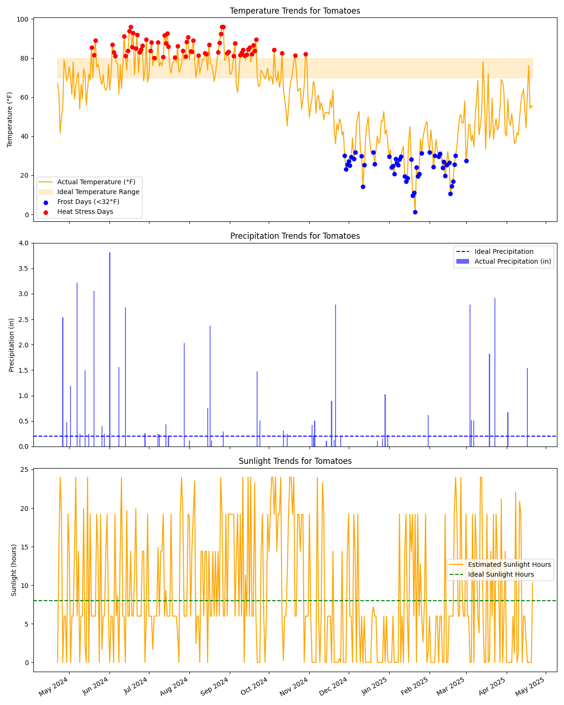

# Weather Crop Data Pipeline

This project is an ETL pipeline that fetches, processes, and analyzes weather data to help urban farmers optimize crop growth conditions. It uses the OpenWeather API and Google Cloud Storage for data storage and visualization. 

**note**: Currently displaying Tomatoes data, refreshes daily with GitHub Actions

## Features
- Fetch current and historical weather data using the OpenWeather API.
- Analyze weather data for ideal crop growth conditions.
- Generate visualizations to compare actual vs. ideal conditions.
- Upload processed data and graphs to Google Cloud Storage.
- Automate the pipeline using GitHub Actions and Terraform.

## Project Structure
weather-crop-data-pipeline/ 

├── .github/ # GitHub Actions workflows 

├── data/ # Data files (CSV) 

├── graphs/ # Generated graphs 

├── src/ # Python scripts 

├── tests/ # Unit tests 

├── terraform/ # Terraform configuration 

├── .gitignore # Ignored files 

├── README.md # Project documentation 


## Setup Instructions
1. Clone the repository:
   ```bash
   git clone https://github.com/<your-username>/weather-crop-data-pipeline.git
   cd weather-crop-data-pipeline
2. Install dependencies
   ```bash
   pip install -r requirements.txt
3. Set up environment variables:
   ```bash

   WEATHER_API_KEY: Your OpenWeather API key.
   GOOGLE_APPLICATION_CREDENTIALS: Path to your Google Cloud service account key.
4. Run the pipeline
   ```bash
   python src/fetch_weather_data.py
   python src/analyze_weather_data.py
4. Upload data to Google Cloud
   ```bash
   python src/upload_to_gcp.py <crop_name>

## Visualizations
Generated graphs are stored in the graphs/ directory. Example: 

## Automation
The pipeline is automated using GitHub Actions. See .github/workflows/main.yml.

## Infrastructure
Terraform is used to provision Google Cloud resources. See terraform/.

## License
MIT License
